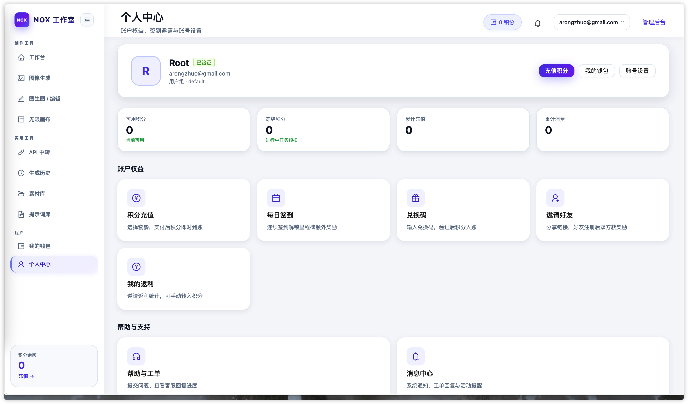
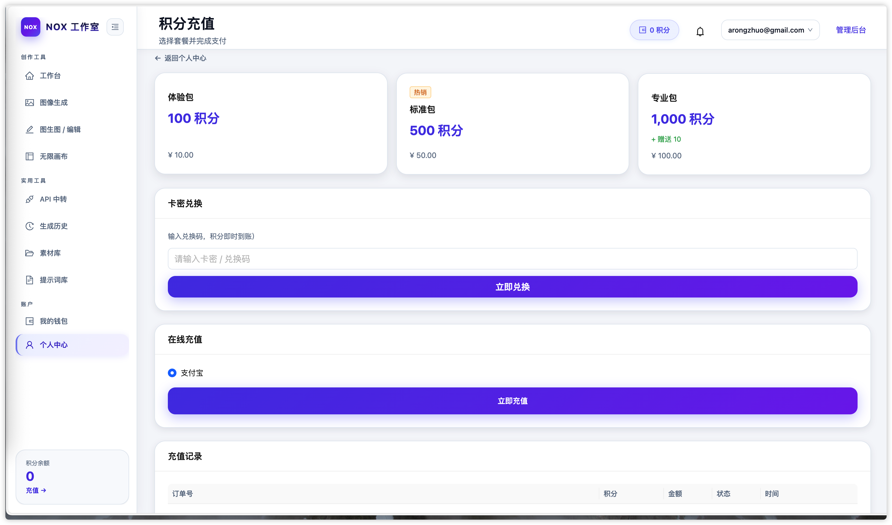
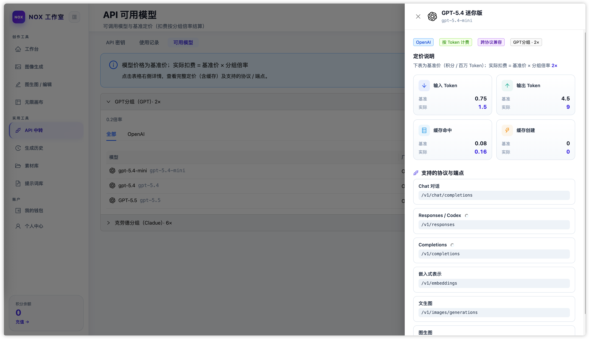
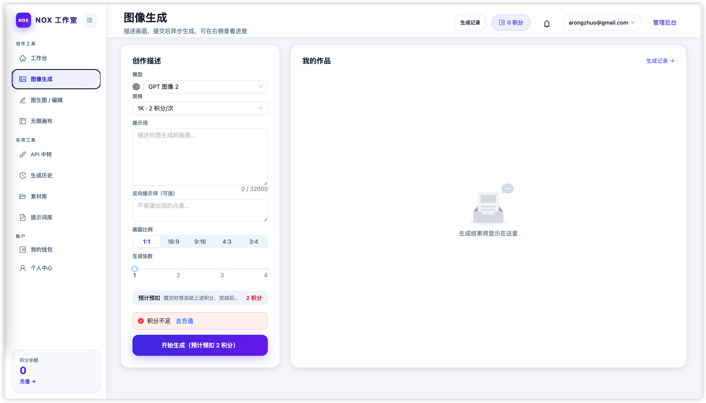
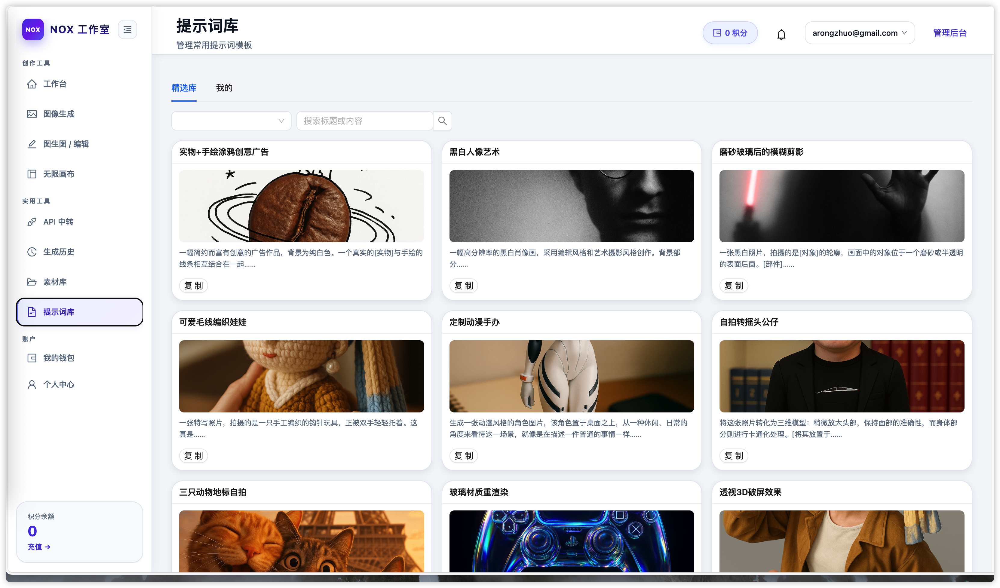
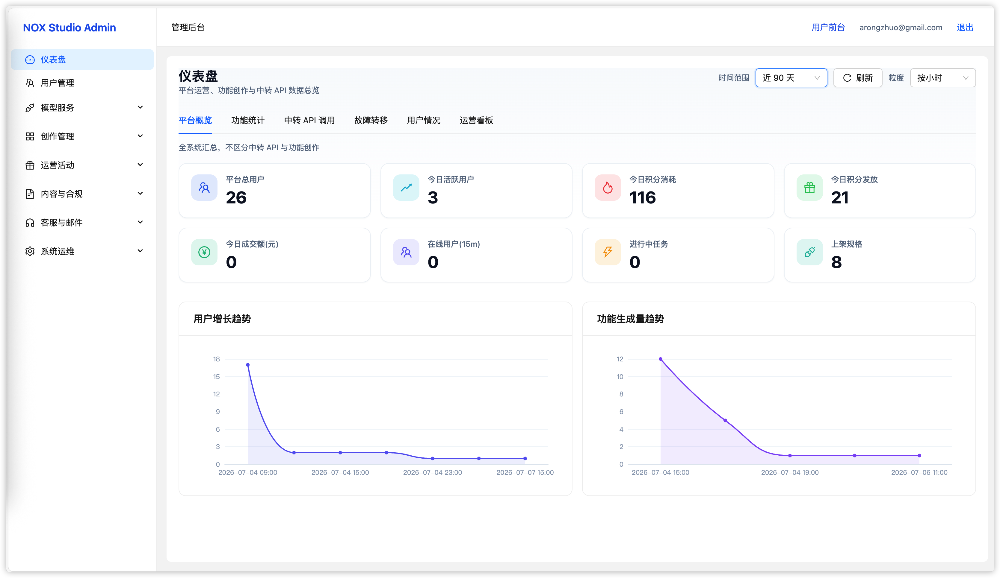
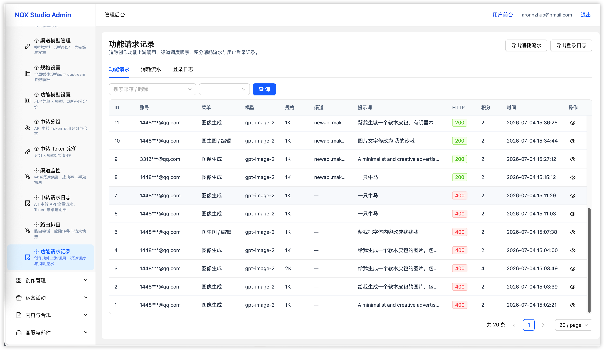
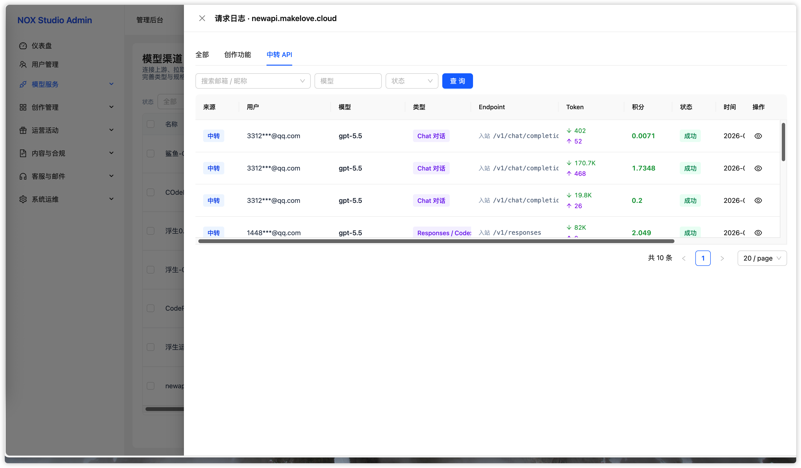

# NOX Studio 功能清单

## 1. 用户与账号体系



| 功能   | 说明                                    |
| ---- | ------------------------------------- |
| 邮箱注册 | 支持邮箱注册、邮箱唯一校验、验证码/验证链接、人机验证、注册协议勾选    |
| 登录会话 | 邮箱密码登录、JWT 会话、Refresh Token、登出、退出所有设备 |
| 邮箱验证 | 未验证邮箱可限制生成和充值，支持重发验证码和验证状态提醒          |
| 找回密码 | 通过注册邮箱找回密码，支持验证码或一次性链接                |
| 个人中心 | 昵称、头像、密码修改、邮箱管理、积分概览、账号注销入口           |
| 邀请推广 | 专属邀请码/邀请链接、邀请绑定、奖励积分、邀请统计             |
| 用户分组 | 默认组、VIP 组、折扣倍率、模型权限、并发限制              |
| 钱包中心 | 余额、冻结积分、流水明细、充值订单、兑换码、消费账单            |


## 2. 积分与计费体系


| 功能   | 说明                               |
| ---- | -------------------------------- |
| 积分账户 | 支持可用积分、冻结积分、累计充值、累计消耗            |
| 积分流水 | 记录充值、兑换、消费、退还、奖励、签到、活动、管理员调整     |
| 生成预扣 | 生成前检查余额并冻结积分，避免任务完成后余额不足         |
| 成功结算 | 图片按张计费，视频按秒或规格计费，支持价格快照          |
| 失败退款 | 上游失败、超时、渠道耗尽时自动释放冻结或退还积分         |
| 幂等扣费 | 通过请求 ID 或 Idempotency-Key 防止重复扣费 |
| 活动折扣 | 支持活动价、折扣倍率、满减、用户组折扣叠加策略          |
| 成本核算 | 区分用户售价和渠道成本，支持利润统计与对账            |


## 3. 充值、兑换与运营变现



| 功能    | 说明                         |
| ----- | -------------------------- |
| 充值套餐  | 后台配置套餐金额、积分、赠送、标签、上下架和排序   |
| 在线支付  | 可接入微信、支付宝、易支付、Stripe 等支付渠道 |
| 订单管理  | 订单创建、支付回调、超时关闭、补单、退款、状态查询  |
| 兑换码   | 批量生成兑换码、设置积分、有效期、使用次数和适用用户 |
| 管理员调账 | 后台手动加扣积分、批量发放、备注和审计        |
| 充值赠送  | 充 X 送 Y、活动期间生效、赠送上限、流水记录   |
| 邀请返利  | 邀请注册、首次充值返利、返利账户、返利流水      |


## 4. 渠道与模型网关



| 功能       | 说明                                         |
| -------- | ------------------------------------------ |
| 渠道管理     | 管理 OpenAI、Azure、Claude、Gemini、火山、MJ、兼容站等渠道 |
| 多 Key 配置 | 支持同渠道多密钥、轮询、优先级、权重和状态管理                    |
| 模型映射     | 平台模型名映射到上游实际模型名，前台不暴露上游细节                  |
| 能力矩阵     | 按渠道配置文生图、图生图、生视频、聊天等能力和规格                  |
| 产品规格     | 面向用户展示 2K 生图、4K 生图、720p 视频等产品规格            |
| 调度策略     | 按优先级、权重、用户组、能力规格筛选候选渠道                     |
| 故障转移     | 渠道失败自动切换备选渠道，用户端保持统一生成体验                   |
| 熔断健康     | 连续失败自动熔断，恢复后半开探测，后台查看成功率与延迟                |
| 上游探测     | 探测渠道支持的模型列表，生成平台模型目录和能力草稿                  |
| 响应过滤     | C 端不返回 channel_id、渠道名称、上游原始错误和敏感信息         |


## 5. AI 创作能力



| 功能    | 说明                           |
| ----- | ---------------------------- |
| 文生图   | 输入提示词生成图片，支持模型、规格、比例、数量等参数   |
| 图生图   | 上传参考图或 mask，进行图片编辑、重绘、变体生成   |
| 文生视频  | 输入提示词生成视频，支持分辨率、时长、参考素材和异步轮询 |
| 批量生成  | 支持多张图片批量生成，部分成功按成功数量结算       |
| 任务队列  | 超并发任务排队，支持取消未开始任务并释放预扣       |
| 生成历史  | 保存提示词、结果、状态、消耗积分、重新生成和删除     |
| 结果下载  | 支持图片/视频下载、保存到素材库、继续编辑        |
| 长任务进度 | 视频任务轮询状态，可扩展 SSE 实时推送        |


## 6. 无限画布与工作流创作


| 功能    | 说明                                     |
| ----- | -------------------------------------- |
| 画布项目  | 创建、重命名、删除、打开和云端保存画布项目                  |
| 画布交互  | 平移、缩放、框选、撤销重做、小地图、快捷键                  |
| 节点类型  | 图片节点、文本节点、配置节点、视频节点、音频节点               |
| 节点连线  | 通过节点连接形成上下游创作流程                        |
| 画布内生成 | 在画布中调用平台生图、生视频或文本能力                    |
| 素材引用  | 生成结果可进入素材库，素材可重新放回画布                   |
| 导入导出  | 支持 JSON 导入导出，可兼容 infinite-canvas 工作流格式 |


## 7. 资产、素材与存储



| 功能     | 说明                      |
| ------ | ----------------------- |
| 我的素材   | 管理图片、视频、文本、提示词等素材       |
| 提示词库   | 支持平台提示词、远程提示词源、用户私有提示词  |
| 文件上传   | 头像、参考图、工单附件、素材、画布媒体统一上传 |
| OSS 存储 | 私有桶存储、预签名上传、归属校验后签名访问   |
| 存储配额   | 按用户限制存储容量，支持超限提示和清理     |
| 生命周期   | 生成物可自动清理，用户保存到素材库后可长期保留 |


## 8. 管理后台



| 功能    | 说明                        |
| ----- | ------------------------- |
| 管理员认证 | 管理员登录、角色权限、RBAC、操作审计      |
| 用户管理  | 用户列表、详情、禁用启用、调整积分、改组、菜单授权 |
| 渠道管理  | 渠道增删改查、密钥脱敏、连通性测试、余额查询    |
| 模型设置  | 平台模型、上游模型、规格、定价、能力绑定      |
| 订单管理  | 充值套餐、充值订单、支付配置、补单退款       |
| 兑换码管理 | 兑换码批量生成、使用记录、失效和导出        |
| 功能管理  | 创作应用启用、排序、输入表单、模型绑定和运行日志  |
| 内容运营  | 公告、协议、FAQ、活动、签到、提示词源      |
| 系统设置  | 站点信息、注册开关、邮件、存储、限流、维护模式   |


## 9. 日志、审计与统计





| 功能     | 说明                                 |
| ------ | ---------------------------------- |
| 模型请求日志 | 记录请求 ID、用户、模型、渠道、耗时、成本、失败原因        |
| 使用日志   | 用户侧查看生成记录、消耗积分和结果状态                |
| 积分流水   | 用户和管理员均可查看积分变化来源                   |
| 登录日志   | 记录 IP、设备、时间、成功/失败状态                |
| 审计日志   | 管理员写操作全量留痕，便于追踪问题                  |
| 统计仪表盘  | 用户增长、充值、消耗、生成量、渠道成本、利润趋势           |
| 路由排查   | 查看 RoutingSession、尝试链路、最终命中渠道和失败原因 |


## 10. 邮件、通知与告警


| 功能      | 说明                        |
| ------- | ------------------------- |
| SMTP 配置 | 邮件服务器配置、连接测试、发信限流、失败重试    |
| 邮件模板    | 注册验证、找回密码、订单通知、工单回复、告警等模板 |
| 消息中心    | 系统通知、活动通知、工单回复、生成完成提醒     |
| 告警规则    | 渠道失败、余额不足、任务异常、授权到期等事件告警  |
| Bark 通知 | 支持 Bark 推送到移动设备           |
| 告警日志    | 记录触发时间、事件类型、发送结果和处理状态     |


## 11. 工单与客服


| 功能   | 说明                        |
| ---- | ------------------------- |
| 工单提交 | 用户提交账户、积分、充值、生成异常、功能建议等问题 |
| 附件上传 | 支持图片、视频等附件上传并归属校验         |
| 后台处理 | 管理员回复、变更状态、标记优先级          |
| 消息通知 | 工单回复可站内通知或邮件通知用户          |


## 12. API 中转站


| 功能        | 说明                           |
| --------- | ---------------------------- |
| API Key   | 用户创建、禁用、删除、查看用量              |
| 模型分组      | 管理不同分组可用模型、价格和渠道             |
| OpenAI 兼容 | 对外提供兼容 OpenAI 的 `/v1/*` 调用入口 |
| 用量统计      | 记录请求量、Token、消耗、错误率和调用日志      |
| 返利体系      | 支持邀请返利、返利账户、返利转积分            |
| 管理监控      | 后台查看 API Key、请求日志、渠道消耗和异常    |


## 13. 授权、部署与安全


| 功能        | 说明                                    |
| --------- | ------------------------------------- |
| 部署授权      | 支持授权密钥、实例绑定、授权刷新、授权状态展示               |
| 到期控制      | 授权到期、吊销、实例不匹配时限制关键能力                  |
| 离线宽限      | 私有化部署场景支持离线宽限期和联网刷新                   |
| Docker 部署 | 支持 Docker 单镜像部署，配套 MySQL、Redis、OSS 配置 |
| 数据安全      | 用户资源必须按 user_id 归属校验，避免越权访问           |
| 密钥安全      | 上游 Key 加密存储、后台脱敏、日志脱敏                 |
| 维护模式      | 后台开启维护，前台暂停生成和支付等高风险操作                |


## 14. 可扩展创作应用

NOX Studio 的创作采用插件式设计，后续更新计划：

- 剧本创作
- 分镜提示词
- 视频翻译
- 数字人/会说话头像
- 商品图生成
- 营销文案生成
- 短视频脚本生成
- 批量图片处理
- 企业私有模型接入


## 联系方式

如需试用、演示、报价、授权购买或私有化部署，请联系：

```markdown
- QQ群：1055120374
```
